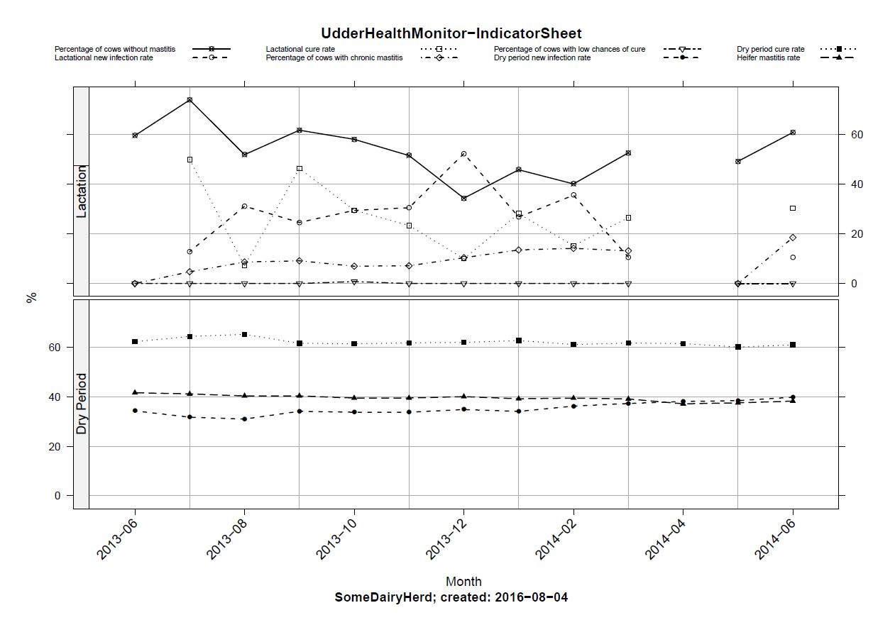

# UdderHealthMonitor

UdderHealtMonitor is a package for [R](https://www.r-project.org/) that contains 
functions to analyse the udder health of dairy cow herds using somatic cell count 
data from Dairy Herd Improvement Tests. Its function `IndicatorSheet` 
allows even absolute R-newbies to produce pretty reports. 
After installation, only 2 (!) lines have to be typed at the R prompt:  

```
  > library(UdderHealthMonitor)  
  > IndicatorSheet()  
```

Then, dialog boxes will ask the user about all required information - and you will 
receive the report:  
  

See the user guide in the vignettes or the [wiki](https://github.com/VZoche-Golob/UdderHealthMonitor/wiki) for details [**OLD**].   

***

## Important Note:  

Currently, I am completely reconstructing the package to avoid the dependency on LaTeX.
Therefore, many of the old functions don't work and some analyses are temporary not available.
---And particularly, the documentation is not up to date.   
I recommend users who are not familiar with R to only use `IndicatorSheet()`.   

***

UdderHealthMonitor is OpenSource Software under GPL-3 License.
