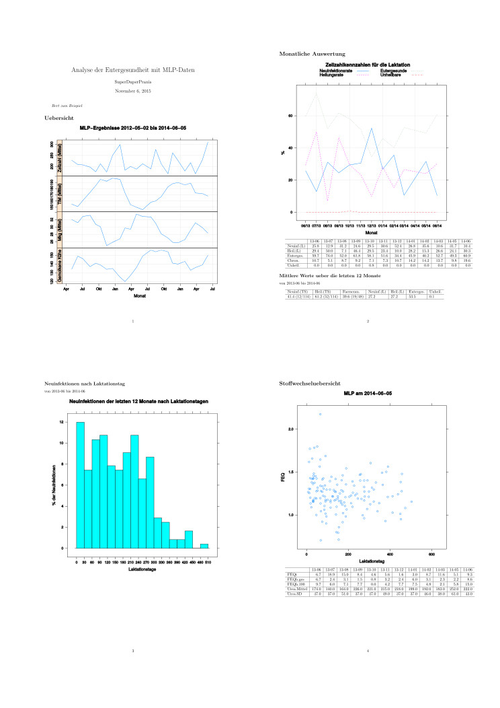

# UdderHealthMonitor

UdderHealtMonitor is a package for [R](https://www.r-project.org/) that contains 
functions to analyse the udder health of dairy cow herds using somatic cell count 
data from Dairy Herd Improvement Tests. Its main function `monitor_SCCUdderHealth` 
allows even absolute R-newbies to produce pretty reports. 
After installation, only 2 (!) lines have to be typed at the R prompt:  

```
  > library(UdderHealthMonitor)  
  > monitor_SCCUdderHealth()  
```

Then, dialog boxes will ask the user about all required information - and you will 
receive the report:  
  

See the user guide in the vignettes or the [wiki](https://github.com/VZoche-Golob/UdderHealthMonitor/wiki) for details.

***

UdderHealthMonitor is OpenSource Software under GPL-3 License.
