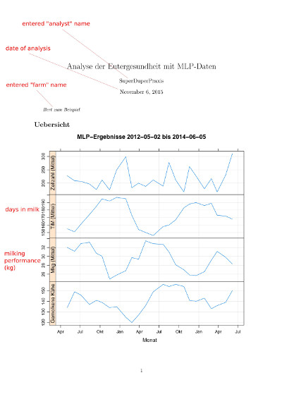
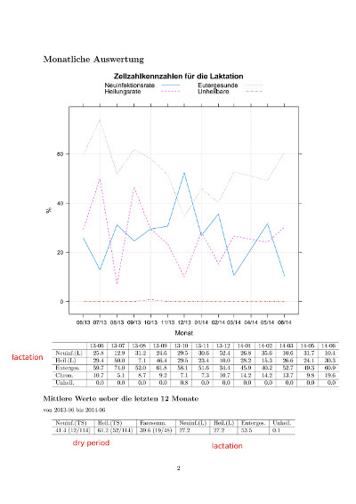
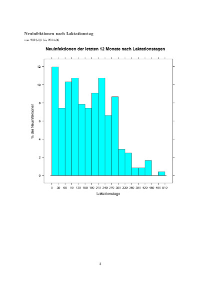
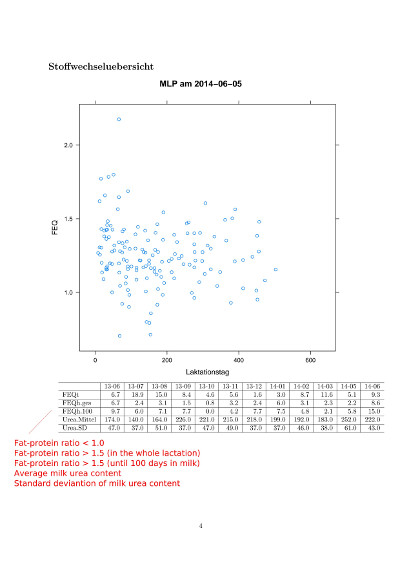
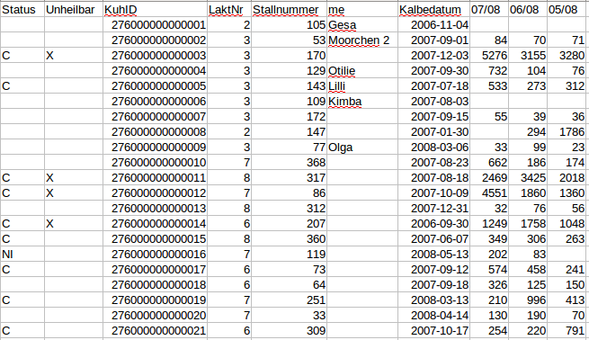

---
title: "User Guide For UdderHealthMonitor"
author: "Veit Zoche-Golob"
date: "`r Sys.Date()`"
output: 
  rmarkdown::html_vignette:
    toc: true
vignette: >
  %\VignetteIndexEntry{User Guide For UdderHealthMonitor}
  %\VignetteEngine{knitr::rmarkdown}
  \usepackage[utf8]{inputenc}
references:
- id: ripley2015
  title: R can’t find my file, but I know it is there!
  author:
  - family: Ripley
    given: B. D.
  - family: Murdoch
    given: D. J.
  publisher: CRAN
  issued: 
  - year: 2015
  chapter: 2.16
  container-title: R for Windows FAQ
  edition: Version for R-3.2.2
  URL: 'http://www.r-project.org'
  type: chapter
- id: dlq2014
  title: DLQ-Richtlinie 1.15 - Zur Definition und Berechnung von Kennzahlen zum Eutergesundheitsmonitoring in der Herde und von deren Vergleichswerten
  author: 
  - family: DLQ
  publisher: Deutscher Verband für Leistungs- und Qualitätsprüfungen e.V.
  issued:
  - year: 2014
    month: 11
    day: 17
  adress: 
  - city: Bonn
  URL: 'http://www.milchqplus.de/services/files/milchqplus/kennzahlen/DLQ%20Richtlinie%201.15%20Kennzahlen.pdf'
  type: book
- id: kro2013a
  title: Personal communication
  author: 
  - family: Krömker
    given: V.
  issued:
  - year: 2013
    month: 7
    day: 22
  type: book
- id: kro2013b
  title: Habe ich zu viele Kühe mit chronischen Euterentzündungen?
  container-title: Merkblätter zur Eutergesundheit
  author: 
  - family: Krömker
    given: V.
  publisher: milchQplus
  issued:
  - year: 2013
  URL: 'http://www.milchqplus.de/services/files/milchqplus/merkblaetter/mastitis/Mastitis1_Chron%20Euterentz%C3%BCngungen_20131204.pdf'
  type: chapter
- id: milch2013
  title: Merkblätter Kennzahlen
  author:
  - family: milchQplus
  issued:
  - year: 2013
  URL: 'http://www.milchqplus.de/merkblaetter_kennzahlen.html'
- id: zo2011
  title: Risikoorientiertes Monitoring der Eutergesundheit - Eine Literaturübersicht
  author:
  - family: Zoche
    given: V.
  - family: Heuwieser
    given: W.
  - family: Krömker
    given: V.
  container-title: Tierärztliche Praxis
  volume: G
  issue: 2
  page: 88-94
  issued:
    - year: 2011
  URL: 'http://www.schattauer.de/t3page/1214.html?manuscript=16040'
  type: article-journal
- id: zo2012
  title: Problemorientiertes Monitoring der Eutergesundheit
  container-title: Herausforderungen der Zukunft in der Mastitisbekämpfung
  publisher: Verlag der DVG Service GmbH, Giessen
  page: 94-99
  issued:
  - year: 2012
  author:
  - family: Zoche
    given: V.
  - family: Heuwieser
    given: W.
  - family: Krömker
    given: V.
  URL: 'http://www.researchgate.net/publication/261654861_Problemorientiertes_Monitoring_der_Eutergesundheit'
  type: chapter
...


**UdderHealthMonitor** is a valuable R-package for users - particulary R-newbies - 
who want to analyse the udder health of dairy cow herds using somatic cell count 
(**SCC**^[SCC is always given in 1000 Cells/ml]) data from Dairy Herd Improvement Tests. 
It refers to the udder health indicators described at 
[milchQplus.de](http://www.milchqplus.de)^[However, in **UdderHealthMonitor** version 0.1, 
it is not checked yet, whether _exactly_ the definitions of the [DLQ guideline 1.15](http://www.milchqplus.de/dlq_richtlinie.html) are used, because the functions 
of **UdderHealthMonitor** were written before the publication of the guideline.].  
  
The main function `monitor_SCCUdderHealth()` reads ADIS/ADED coded data, 
automatically generates a pretty [report](#report) with the most relevant indicators for 
the udder health, and provides a [csv-file](#table) with the udder health status of all cows.  
  
This user Guide mainly addresses to dairy herd consultants who are not familiar 
with [R](https://www.r-project.org/) and just want to use the reports. But the [further 
information](#further) provided at the end of this document may be interesting to those who 
are already _useRs_, too.  


## Installation  {#installation}

Before **UdderHealthMonitor** itself can be installed, [R](https://www.r-project.org/) 
and some packages have to be installed first.


#### Install R

Download and install R from a [CRAN mirror](https://cran.r-project.org/mirrors.html).   

While choosing your version of R, you will find links to useful advice. There are also 
answers about the installation procedure in the [FAQ](https://cran.r-project.org/doc/FAQ/R-FAQ.html#How-can-R-be-installed_003f) 
and a [manual](https://cran.r-project.org/doc/manuals/r-release/R-admin.html).  


#### Install Packages From CRAN

After successfully installing it, start R on your computer. (As this is not the same 
on all platforms (Linux, Windows, Mac, ...), no description is given here. Please 
use the help from [R-project](https://www.r-project.org/) instead.)  

At the R prompt (usually `>`), type or copy and paste the following code completely 
and hit the `<return>` key only once after the final closing bracket.  

```
install.packages(c("assertive", 
                   "devtools", 
                   "knitr", 
                   "lattice", 
                   "magrittr", 
                   "rmarkdown", 
                   "svDialogs"))
```

This will install the required packages that are available from CRAN.  


#### Install Packages From Github

The packages **RAdis** and **UdderHealthMonitor** itself are not on CRAN, but 
published on [Github](https://github.com/). The easiest way to install them is to 
use the package [devtools](http://cran.r-project.org/web/packages/devtools/index.html).  

Type at the R prompt the following lines, each followed by a hit to `<return>`:

```
  devtools::install_github(repo = "VZoche-Golob/RAdis")
  devtools::install_github(repo = "VZoche-Golob/UdderHealthMonitor")
```

Now, **UdderHealthMonitor** is installed and ready to use.  


## Simple Usage  {#usage}

1. Start R.
2. Type at the R prompt and hit `<return>` after each line:  

```
  library(UdderHealthMonitor)  
  monitor_SCCUdderHealth()  
```

3. Choose the data file to analyse.  
4. Enter a name / description for the herd that should be used in the report.  
5. Enter the name of the analyst / author that should be used in the report.  

When the R prompt is visible again, you should find two new files in the 
folder of the data file, that you selected in step 3:  

* The [Report](#report) - `YourSelectedFile_MLPUdderHealthReport_TimeOfAnalysis.pdf`  
* A [Table Of Cows](#table) - `YourSelectedFile_alleKuehe_TimeOfAnalysis.csv`  

At version 0.1, **UdderHealthMonitor** can only analyse data files in 
[ADIS/ADED format](http://ian.lkv-nrw.de/index.php?id=308), see section [Data Requirements](#datarequirements).


#### Faster input  {#fast}

It is faster to combine steps 3-5 into step 2. Just enter:  

```
  library(UdderHealthMonitor)  
  monitor_SCCUdderHealth("full/path/to/the/data/file.ads", "FarmName", "AnalystName")  
```

Of course, you should replace the arguments appropriately.  

A small hint for Windows-Users [[@ripley2015]](#lit):

> Backslashes have to be doubled in R character strings, so for example one needs 
`d:\\R-3.2.2\\library\\xgobi\\scripts\\xgobi.bat`. You can make life easier for 
yourself by using forward slashes as path separators: they do work under Windows. 
You should include the file extension (e.g. `xgobi.bat` rather than just `xgobi`); 
sometimes this isn’t shown in Windows Explorer, but it is necessary in R.   


### The Report  {#report}

The major purpose of **UdderHealthMonitor** is to provide very quickly a report 
that enables its users to analyse the udder health situation of a dairy cow herd 
easily. The users of **UdderHealthMonitor** should not be bothered with the data 
management themselves. To allow discussions and comparisons between users, well-defined 
and published indicators for the udder health are calculated.  

  
**Page 1:** Overview with monthly averages for 24 months   


    
**Page 2:** Udder health indicators     

Monthly values are provided in the figure and the table below it for:   

* Percentage of cows without mastitis ("Eutergesunde" / "Euterges.")  
* Lactational new infection rate ("Neuinfektionsrate" / "Neuinf.(L)")  
* Lactational cure rate ("Heilungsrate" / "Heil.(L)")  
* Percentage of cows with chronic mastitis ("Chronische" / "Chron.")    
* Percentage of cows with low chances of cure ("Unheilbare" / "Unheil.")   

Average values for 12 months are provided in the table at the bottom for:  

* Dry period new infection rate ("Neuinf.(TS)")  
* Dry period cure rate ("Heil.(TS)")   
* Heifer mastitis rate ("Faersenm.")  
* Lactational new infection rate ("Neuinfektionsrate")  
* Lactational cure rate ("Heil.(L)")  
* Percentage of cows without mastitis ("Euterges.")  
* Percentage of cows with low chances of cure ("Unheil.")    


  
**Page 3:** Percentage of new infections in 12 months by days in milk   


    
**Page 4:** Overview of the metabolic status of the herd    

The scatter plot shows the distribution of the cows' milk fat-protein ratios by 
their days in milk. In the first three rows of the table below percentages of cows 
separately for 12 months are presented:  

* the percentage of cows with fat-protein ratios < 1.0 in all lactating cows ("FEQt")  
* the percentage of cows with fat-protein ratios > 1.5 in all lactating cows ("FEQh.ges")   
* the percentage of cows below 100 days in milk with fat-protein ratios > 1.5 in all lactating cows with at most 100 days in milk ("FEQh.100")   

The last two lines of the table contain monthly values of the herd average ("Urea.Mittel") 
and standard deviation ("Urea.SD") of the milk urea content.  


### The Table Of Cows  {#table}

Together with the report, a table of all cows in a separate 
csv-file^[Files in .csv format can be used in all spreadsheet programs like MS Excel.] 
is returned.   

  

'Status' can be nothing, `C` (= chronic mastitis), or `NI` (= new infection).  
'Unheilbar' will be marked if the cow is considered to have low chances of cure.  
'KuhID', 'Stallnummer' and 'Name' identify the individual cow.  
'LaktNr' is the number of the current lactation per cow, starting with calving at 
'Kalbedatum'.  
The last three columns give the SCC in the last three Dairy Herd Improvement Tests 
in descending order.  


## Further Information  {#further}


### Data Requirements {#datarequirements}

**UdderHealthMonitor**, version 0.1, can only analyse data in 
[ADIS/ADED format](http://ian.lkv-nrw.de/index.php?id=308). Of this physical file, 
only the first virtual file (with the first header) is used. For 
the complete analysis, the file has to contain the following entities:   

Entity  |  Items in entity   
------- | ----------------
880028  |  00800181, 00800004, 00800043, 00800182, 00800183, 00800194, 00800184, 00800185, 00800188, 00800154, 00800166  
880005  |  00900080, 00900070, 00900045, 00900053, 00800111  
880003  |  00900080, 00800043, 00900034, 00900038, 00800041, 00800041  
880012  |  00900080, 00900028, 00800105  
880006  |  00900080, 00900032, 00800044, 00800046, 00800043, 00800051, 00800102, 00800066, 00800709  

Dictionaries describing the entities and items can be found at http://ian.lkv-nrw.de/index.php?id=309 
and https://webapp.lkv-nrw.de/AdedDataDictionary/.  

The 'PCstart' and 'PCBerater' ADIS files from [VIT](http://www.vit.de/index.php?id=datenbereitstellung) 
fulfill these requirements.   

Currently, all cows of a farm are analysed together, i.e. entries of different 'AE's 
are ignored.  


### Definitions Of Indicators  {#definitions}

#### Indicators for the lactation period

Name                                                            |  Definition  
--------------------------------------------------------------- | -----------  
Percentage of cows without mastitis [[@dlq2014]](#lit)          |  Percentage of cows with SCC ≤ 100 in all lactating cows at the recent test  
Lactational new infection rate [[@dlq2014]](#lit)               |  Percentage of cows with SCC > 100 at the recent test day in all cows with SCC ≤ 100 at preceding test day     
Lactational cure rate [[@kro2013a]](#lit)                       |  Percentage of cows with SCC ≤ 100 at the recent test day in all cows with SCC > 100 at preceding test day     
Percentage of cows with chronic mastitis [[@kro2013b]](#lit)    |  Percentage of cows with SCC > 200 at the last two consecutive test days in all lactating cows  
Percentage of cows with low chances of cure [[@dlq2014]](#lit)  |  Percentage of cows with SCC > 700 at the last three consecutive test days in all lactating cows  


#### Indicators for the dry period

Name                                              |  Definition  
------------------------------------------------- | -----------  
Dry period new infection rate [[@dlq2014]](#lit)  |  Percentage of cows with SCC > 100 at the first test day in the lactation in all cows that were dried off with SCC ≤ 100  
Dry period cure rate [[@dlq2014]](#lit)           |  Percentage of cows with SCC ≤ 100 at the first test day in the lactation in all cows that were dried off with SCC > 100  
Heifer mastitis rate [[@dlq2014]](#lit)           |  Percentage of cows in their first lactation with SCC > 100 at the first test day in the lactation in all cows in their first lactation  


### Comparative Values  {#compvalues}

Indicator^[The comparative values are based on Lower Saxony.]  |  Average herd  |  Best herds  |  Reference  
-------------------------------------------------------------- | -------------- | ------------ | ----------  
Percentage of cows without mastitis                            |  50%           |  >76%        |  [[@milch2013]](#lit)  
Lactational new infection rate                                 |  21%           |  <11%        |  [[@milch2013]](#lit)  
Lactational cure rate                                          |  17%           |  >25%        |  [[@kro2013a]](#lit)  
Percentage of cows with chronic mastitis                       |                |              |  ^[≤10% cows with chronic mastitis is acceptable, ≤5% is very good [[@kro2013b]](#lit).]   
Percentage of cows with low chances of cure                    |   5%           |   <1%        |  [[@milch2013]](#lit)   
Dry period new infection rate                                  |  28%           |  <15%        |  [[@milch2013]](#lit)     
Dry period cure rate                                           |  53%           |  >70%        |  [[@milch2013]](#lit)  
Heifer mastitis rate                                           |  40%           |  <15%        |  [[@milch2013]](#lit)    


### User Generated Report Templates  {#usertemplates}

User can create their individual template for the reports and use it in `monitor_SCCUdderHealth()`. 
The template has to be a [Sweave](http://www.statistik.lmu.de/~leisch/Sweave/) file 
and must not require other data than returned by the functions `prepare_PCstart()` 
and `monitor_SCCUdderHealth()` (see their documentations ^[The documentation of R 
functions can be obtained by typing `?TheFunctionNameWithoutBrackets` at the R prompt (Be aware that R is case-sensitive.).]). The default template ([inst/extdata/MLPUdderHealthReport.Rnw](extdata/MLPUdderHealtReport.Rnw)) 
should be used as example.  

To use **UdderHealthMonitor** with a user template, load the package with  

```
  library(UdderHealthMonitor)
```

and call the main function with the additional argument `usertemplate`:     

```
  monitor_SCCUdderHealth(usertemplate = "full/path/to/your/template.Rnw")
```

Of course, you can also use the [faster input](#fast) which avoids the dialog boxes.


### Literature  {#lit}

A practical guide how to install a monitoring program for the udder health of dairy 
cow herds has been published by Zoche et al. [[-@zo2011; -@zo2012]](#lit). There is 
also a [handout](http://www.lkvsachsen.de/fileadmin/lkv/redaktion/download/unternehmen/Veredlungsland/Handout_Euterschulung.pdf) from a workshop about controlling the udder health available from 
the Saxon Dairy Herd Improvement Association.  

#### References 


